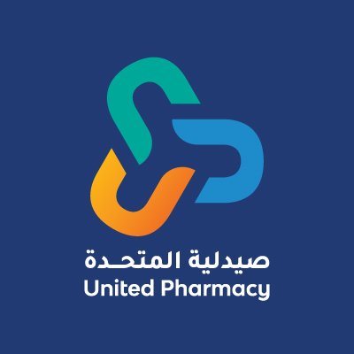

# 🏥 United Pharmacy - L&D Coordinator Tool
### أداة منسق التدريب والتطوير - صيدليات المتحدة



أداة ويب عصرية وسريعة مخصصة لمنسقي التدريب والتطوير (L&D Coordinators) في **صيدليات المتحدة (United Pharmacy)** لأتمتة وتنظيم جهات الاتصال الخاصة بالمتدربين والصيادلة، وحفظها جميعاً على الهاتف بنقرة واحدة، وإنشاء مجموعات الواتساب الرسمية بكل سهولة.

---

## 🌟 الميزات الرئيسية (Key Features)

1. **طرق إدخال مرنة (Multiple Input Methods)**:
   - 📊 **ملف إكسيل / CSV**: استيراد وقراءة تلقائية لأعمدة الأسماء وأرقام الهواتف مهما كان ترتيبها.
   - 📋 **نسخ ولصق نصوص**: استخراج الأسماء والأرقام من النصوص العشوائية والقوائم المنسوخة بذكاء.
   - 🖼️ **استخراج من الصور (OCR)**: قراءة الأسماء والأرقام من لقطات الشاشة والصور مباشرة عبر تقنية التعرف الضوئي على الحروف.

2. **التخصيص والوسم الجماعي (Wave Tagging)**:
   - إضافة وسم الدفعة تلقائياً لكافة الأسماء (مثل `Wave 6 - ` أو `Wave 7 - ` أو أي وسم مخصص).
   - توحيد وتنسيق كود الدولة تلقائياً (مصر `+20`، السعودية `+966`، الإمارات `+971`).
   - فحص وحذف الأرقام المكررة بنقرة زر واحدة.
   - معاينة حية لشكل الاسم كما سيظهر على شاشة الهاتف والواتساب.

3. **الحفظ الفوري على الهاتف (One-Click Mobile Sync)**:
   - **تصدير ملف VCF (vCard 3.0)** موحد متوافق مع كافة هواتف Android و iPhone. بمجرد فتحه على الموبايل، يُسجل جميع المتدربين دفعة واحدة في دليل الهاتف وتظهر أسماؤهم في الواتساب.
   - **رمز QR Code**: لمسح الكود بكاميرا الموبايل وتحميل جهات الاتصال مباشرة.
   - **تصدير Google Contacts (CSV)**: للاستيراد السحابي في حساب جوجل.

4. **مساعد جروب الواتساب (WhatsApp Group Assistant)**:
   - خطوات إرشادية لإنشاء الجروب في 5 ثوانٍ فقط بالبحث عن بادئة الـ Wave واختيار الكل.
   - مولد رسائل الترحيب وقوالب دعوة الجروب ومراسلة المتدربين عبر واتساب بنقرة زر.

5. **الأمان والخصوصية (100% Client-Side Privacy)**:
   - كافة العمليات ومعالجة البيانات وقراءة الملفات تتم محلياً 100% داخل المتصفح دون إرسال أي أرقام أو بيانات لأي سيرفر خارجي.

---

## 🛠️ التقنيات المستخدمة (Tech Stack)

- **React 18** & **Vite**
- **Vanilla CSS Design System** (Glassmorphism, RTL Support, Dark / Light Mode)
- **SheetJS (xlsx)** لمعالجة ملفات الإكسيل
- **Tesseract.js** للتعرف الضوئي على الحروف (OCR)
- **QRCode** لتوليد رموز الاستجابة السريعة
- **Canvas-Confetti** للتأثيرات التفاعلية
- **Lucide React** للأيقونات العصرية

---

## 🚀 التشغيل محلياً (Run Locally)

```bash
# تثبيت الحزم
npm install

# تشغيل خادم التطوير
npm run dev
```

افتح المتصفح على:
`http://localhost:5173/`

---

## 📦 بناء نسخة الإنتاج (Production Build)

```bash
npm run build
```

---

حقوق التصميم والتطوير © صيدليات المتحدة - إدارة التدريب والتطوير (L&D).
